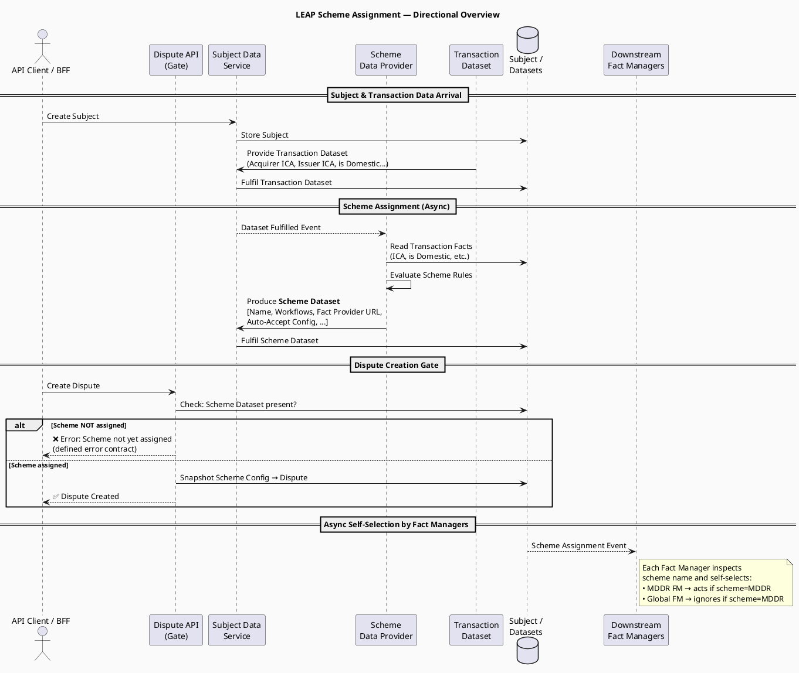

# LEAP Scheme Assignment

- New Data Provider owned and Operated out of Customer Domain
- On Subject Creation, and Data Set provision of both Transaction and some Foundation Transaction Facts
  - Evaluate Transaction Data, Acquirer ICA, Issuer ICA and pull Configuration
  - Evaluate "Transaction facts" datasets and look at things like "is Domestic" to make a decision
  - Produce "Dispute Scheme" Data Set that contains
    - Scheme Name
    - Scheme Workflows
    - Dispute Fact Provider URL/DNS/Logical Name
    - Scheme Specific Config - auto accept liability for each party
    - Any other centralised Configuration
- On Dispute Creation - a Snapshot of this Scheme Configuration is stored in the dispute.
- Dispute Creation isn't an applicable action until we know what scheme rules to run and decide - therefore Can't create dispute until scheme selected. Therefore API tier (which both API Customers and our own BFF leverage) will gate the Dispute Creation until scheme assigned.

## What does this mean?

- Snapshot of the Scheme config at the point of dispute creation is the same that will be applicable by the end.
- The Same Physical LEAP deployment can handle multiple schemes at the same time. Example of this MDDR and Global both hosted out of US-CEntral but need to support different Facts and Workflows
- Data Providers can make scheme based decisions in an Async fashion by waiting for and then looking at the scheme assignement. e.g. Global Dispute Fact Manager can decide "this is MDDR", so I will ignore - whereas the MDDR Fact Manaer can consume and operate.
- Scheme Data Provider is an extremely simple but vitally important part of the system - as it is going to assign Scheme - which will block Disputes if not present. We can fallback to Dispute Manager calling the Scheme Provider explicitly by API if ASync is slow. There needs to be a defined error message at the API tier to reflect the error state of no assigned Scheme.
- Ss its a DataSet - the provider is not important - anyone can provide the dataset - therefore responsibility for deciding the scheme can be changed Deployment by Deployment. MDDR is a perfect example the Integration component "could" be responsible for creating the Schema Configuration at the point of Subject Creation.

[!ai] id="ai-5fd1" ref="doc"

**Ask:** based on what you know about LEAP, Subjects, data sets and Disputes - any comment or observations and above new feature?

Here are my observations based on LEAP's architecture:

---

**✅ Architecturally Consistent** This fits the Data Provider pattern well — a new provider that reacts to Subject/Dataset events and produces a `scheme` dataset. LEAP's Subject Data Service doesn't care what's in it, which is by design.

**⚠️ Dataset Dependency / Ordering** The Scheme provider needs Acquirer/Issuer ICA — which comes from the transaction datasets (`auth`/`clearing`). There's an implicit dependency: the scheme dataset can only be fulfilled *after* those arrive. Ensure the provider reacts to dataset fulfilment events, not just Subject creation.

**🔗 Dispute Fact Provider URL in the Dataset** Smart pattern — this allows multi-scheme deployments to dynamically route to the correct Fact Manager. Aligns with LEAP's goal of scheme-rules centralisation and regional deployment flexibility.

**📸 Snapshot on Dispute Creation** Fully consistent with LEAP's snapshot principle. Worth documenting explicitly: scheme config changes mid-dispute won't be reflected — is that intentional? Likely yes, for consistency.

**🏢 Customer Domain Ownership** Implies scheme configuration is deployment/region-specific, which matches LEAP's design intent. However, it raises a question: who governs correctness of the config (e.g., wrong auto-accept liability settings)?

**❓ Open Questions**

- What happens if the scheme dataset isn't yet fulfilled when a Dispute is created? Blocked? Best-effort snapshot?
- Is `is Domestic` evaluated here or re-used from an existing facts dataset (e.g., Dispute Fact Manager)?

[!ai-end]

[!ai] id="ai-386f" ref="doc,ai-5fd1"

**Ask:** How about now?

A few additional observations on top of the previous analysis:

---

**🚦 Dispute Creation Gate is Significant** "Can't create dispute until scheme selected" introduces a hard prerequisite state. This implies the Subject needs a lifecycle/readiness check — worth explicitly modelling as a Subject state transition rather than implicitly blocking at the Dispute API.

**🔀 Async Scheme-Based Filtering is Elegant** The pattern where downstream providers (e.g., MDDR Fact Manager) self-select by inspecting the scheme assignment is clean pub/sub decoupling. No central router needed — each provider opts in or out. This scales well.

**🔌 "Anyone Can Provide" = Pluggable Scheme Logic** This is underrated. Scheme assignment responsibility can be handed off per deployment without touching anything else in LEAP. Makes it easy to customise for regional/customer-specific rules.

**⚠️ Still Outstanding** The open questions from before remain relevant:

- What if scheme dataset is slow or missing at dispute creation time?
- Governance of config correctness (wrong auto-accept liability) has no clear owner yet.

Overall — solid, consistent design. The main risk is operational: misconfigured scheme data could silently affect many disputes before anyone notices.

[!ai-end]

[!ai] id="ai-683b" ref="doc,ai-5fd1,ai-386f"

**Ask:** explcitly called out -"Can't create dispute until scheme selected"

Yes — it's explicit in the design:

> *"Dispute Creation isn't an applicable action until we know what scheme rules to run and decide — therefore Can't create dispute until scheme selected."*

This is a **hard gate**, not a soft warning. Key implications:

- **Subject readiness matters** — the Dispute API must check for scheme dataset presence before allowing creation. This should be a first-class state, not buried in validation logic.
- **Async race condition risk** — if scheme assignment is slow (e.g., ICA lookup latency, provider delay), users/systems attempting dispute creation will be blocked or fail. You need a clear error contract: *"scheme not yet assigned"* vs *"scheme will never be assigned"*.
- **Operational visibility** — you'll want observability on *how long* subjects sit without a scheme, and alerting if they're stuck.
- **Idempotent retry** — callers must be able to retry dispute creation safely once the scheme arrives.

The gate is correct by design — creating a dispute without scheme context would be meaningless. But it shifts complexity to **when and how** the gate is enforced and communicated.

[!ai-end]

[!ai] id="ai-7c51" ref="doc,ai-5fd1,ai-386f,ai-683b"

**Ask:** final feedback request

**Final Feedback — LEAP Scheme Assignment**

The design is **solid and production-ready in concept**. Here's the consolidated view:

---

**✅ What's Well Designed**

- Dataset-as-scheme-config fits LEAP's model perfectly — pluggable, deployment-scoped, no central coupling
- Snapshot on dispute creation is correct and consistent
- Async self-selection by downstream providers is clean and scalable
- API gate on dispute creation is the right call; explicit error messaging is called out

---

**⚠️ Key Risks to Resolve Before Finalising**

| Risk | Mitigation Needed |
| --- | --- |
| Scheme dataset latency blocking dispute creation | Define retry contract + SLA; consider polling vs event-wait |
| "Never assigned" vs "not yet assigned" ambiguity | Explicit error states at API tier (already mentioned — make sure it's spec'd) |
| Misconfigured scheme config (e.g., wrong liability) | Governance owner must be named per deployment |
| Scheme provider is a single point of failure | Fallback to explicit API call is noted — ensure it's tested |

---

**📋 One Thing Still Missing**

A **schema/contract definition** for the Scheme Dataset itself. Given it gates dispute creation and drives workflow routing, its structure should be formally versioned and validated — not left implicit.

---

Overall: well-thought-out, architecturally coherent. Nail the error contract and dataset schema, and this is ready to build.

[!ai-end]

[!ai] id="ai-2b83" ref="doc,ai-5fd1,ai-386f,ai-683b,ai-7c51"

**Ask:** could you suggets a diagrma in plantuml fomrat to accompany this high direction document.

Asl in terms of feedback this is a directional memo/high level conversation starter. The doc doesnt need everything specified as its beeing handed to a Archietcted to bring the last mile

Here's a PlantUML sequence/component diagram capturing the key flows:

**On your feedback point** — agreed, for a directional memo this is the right level. The architect picks it up from here and owns: schema contract definition, error state spec, SLA/retry design, and governance model per deployment. No need to over-specify in the starter doc.

[!ai-end]