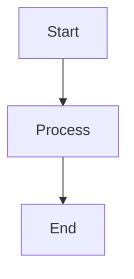

# Sieve Extension Architecture

## 1. The Core Distinction: Containers vs Artefacts

Every special block in Sieve falls into one of three categories. The category determines the on-disk format. Getting the category right is more important than any implementation detail.

### Category 1 — Content Containers

**Definition:** A structural wrapper around user-authored prose. The user wrote the content inside. Another human should be able to read it in any editor.

**Format:** Custom open/close tags on their own lines. Metadata as attributes on the opening tag.

**Fail behaviour:** Must **fail open**. In any markdown viewer that does not understand the tags, the content inside renders as normal prose. The tags appear as visible noise but the content survives intact.

**Current example:** `blockRef`

```
[!block] id="blk-1234"
This is the user's own prose. It must be readable anywhere.
The block tag is structural metadata, not content.
[!block-end]
```

In a dumb viewer: the prose is visible. Tags are ugly but harmless. This is correct and intentional.

**Rule:** Do not change this format. Do not migrate `blockRef` to fenced blocks. The fail-open property is non-negotiable for anything that wraps user-authored text.

---

### Category 2 — User-Authored Structured Content

**Definition:** Content the user wrote, but in a structured form that has an established standard representation. Code is the canonical example.

**Format:** Standard fenced blocks. The fence language tag identifies the type. Light metadata on the info string.

**Fail behaviour:** Fails closed gracefully — a standard markdown viewer renders it as a styled code block. The content is visible inside the fence. This is acceptable because the fence IS the standard representation for this content type.

**Current example:** `CodeBlockWithAttrs`

````
```python id="blk-abc" detect="pending"
def hello():
    return "world"
```
````

In a dumb viewer: renders as a Python code block. Content is visible. The `id` and `detect` attrs on the info string are noise but minimal.

**Rule:** Keep metadata light and on the info string. If metadata grows too large for the info string, the block may be graduating to a machine artefact — reconsider the design.

---

### Category 3 — Machine Artefact Blocks

**Definition:** Content generated or fetched by a machine — AI responses, link card previews, rendered diagrams. The user did not write the content inside. The raw content is not meant to be the primary reading experience; Sieve renders it as a rich interactive block.

**Format:** Fenced YAML. The fence language tag identifies the block type. All metadata and content as named YAML fields.

**Fail behaviour:** Fails closed — a dumb viewer renders a code block with YAML inside. This is acceptable because:
1. The content is machine-generated, not user-authored prose
2. The YAML is human-readable even inside a code block — field names and values are legible
3. "Promote to Document" is the portability story for content worth keeping

**Current examples:** `aiBlock` (migrating), future `link-card`, `image-block`

**Rule:** All new machine artefact block types use fenced YAML. Do not invent a new format.

---

## 2. Why Fenced YAML (Not JSON, Not Ad-hoc Tags)

### Why not ad-hoc tags for machine artefacts?

The `[!ai]...[!ai-end]` format was practical initially but does not scale:

- Metadata is limited to what fits on the opening tag line as space-separated `key="value"` pairs
- Adding fields (status, model, timestamps, collapse state) makes the tag line unwieldy
- The closing tag going missing corrupts everything between that block and the next closing tag
- A bespoke parser (DOM mutation) is required — 80+ lines of fragile code rather than a standard hook

### Why fenced blocks?

- The fence itself is the delimiter — no matching closing tag to lose
- The fence language tag is the block type — consistent with how code blocks already work
- markdown-it has a well-tested fence parsing hook (`renderer.rules.fence`) — 20 lines replaces 80
- All machine artefact blocks use the same structural pattern — one mental model

### Why YAML over JSON?

**Multiline strings.** JSON requires `\n` escaping for newlines:
```json
{ "response": "Paragraph one.\n\nParagraph two.\n\n---\n\nParagraph three." }
```

YAML `|` block scalars preserve content exactly with no escaping:
```yaml
response: |
  Paragraph one.

  Paragraph two.

  ---

  Paragraph three.
```

**No quotes on simple values.** JSON requires `"` around every string. YAML does not:
```yaml
id: abc123
status: COMPLETE
model: claude-sonnet-4-6
```

**The `---` problem is solved.** Markdown uses `---` as a horizontal rule. In YAML, `---` is only a document separator at column 0. Block scalar content is indented — `  ---` is just the string `---`. This eliminates the collision that caused production bugs in the legacy AI block format.

**One parser for all block types.** `window.jsyaml.load(content)` handles simple key-value blocks (link cards, images) and blocks with multiline content (AI responses) with the same call.

### Why not prettified JSON?

For blocks with large prose bodies (AI responses), JSON string escaping turns readable markdown into noise:

```json
"response": "## Heading\n\nSome **bold** text.\n\n```python\ndef hello():\n    pass\n```\n"
```

vs:

```yaml
response: |
  ## Heading

  Some **bold** text.

  ```python
  def hello():
      pass
  ```
```

For blocks that are pure metadata with no prose body (link cards, images), prettified JSON is readable — but YAML is equally readable and uses the same parser. Consistency wins.

---

## 3. The Signal-to-Noise Principle

When a fenced YAML block appears in a dumb markdown renderer (rendered as a code block), the content should still be intelligible to a human. Design the YAML layout to maximise signal, minimise noise, and keep noise localised.

**AI block:** large prose body, small metadata. YAML field names are the labels; the `|` block scalar content is the signal.

````
```ai-block
id: abc123
ref: doc
status: COMPLETE
model: claude-sonnet-4-6
question: What is the strangler fig pattern?
response: |
  It's a migration strategy where you incrementally replace an old system
  alongside a new one, routing traffic gradually until the old is empty.
```
````

**Link card:** pure metadata, but the values ARE the signal. The `title` and `description` read naturally even inside a YAML code block.

````
```link-card
id: abc123
href: https://martinfowler.com/bliki/StranglerFigApplication.html
title: StranglerFigApplication
description: A migration pattern for incrementally replacing legacy systems
site: Martin Fowler
fetchedAt: 2026-05-02T10:00:00Z
```
````

**Image block:** same principle. `src`, `alt`, and `summary` are the signal.

````
```image-block
id: abc123
src: .assets/chart.png
alt: Revenue by quarter
summary: Bar chart showing Q1–Q4 2025 revenue growth
width: 800
height: 600
```
````

---

## 4. YAML Format Reference

### `|` vs `>` block scalars

Always use `|` (literal) for `question` and `response` fields. Never use `>` (folded).

| Indicator | Behaviour | Use for |
|-----------|-----------|---------|
| `\|` | Preserves all newlines exactly | Markdown content — question, response |
| `>` | Folds single newlines into spaces | Long prose that is logically one paragraph — almost never correct for our use case |

### Chomping

The default chomping (`|` with no modifier) keeps one trailing newline. This is correct — trim the parsed value when mapping to node attrs.

### Serializer rules

```js
// Simple scalar — no newlines, no leading special chars
lines.push('key: simple value here')

// Multiline scalar — contains \n
lines.push('key: |')
value.split('\n').forEach(l => lines.push('  ' + (l || '')))

// Empty/absent optional field — omit the line entirely
if (attrs.completedAt) lines.push('completedAt: ' + attrs.completedAt)
```

### Parser

```js
const data = window.jsyaml.load(fenceContent)
// All fields arrive as JS strings (or undefined if absent)
// Trim block scalar values: (data.response || '').trim()
```

---

## 5. Current Extensions Inventory

| Extension | File | Category | On-disk format | Status |
|-----------|------|----------|----------------|--------|
| `blockRef` | `extensions.js` | Container | `[!block]...[!block-end]` | Stable, do not change |
| `aiBlock` | `extensions.js` → `ai-block-extension.js` | Machine artefact | Migrating to fenced YAML | In migration |
| `AiBlockLegacy` | *(new)* `ai-block-legacy-extension.js` | — | Parse-only shim | Temporary |
| `CodeBlockWithAttrs` | `extensions.js` | User structured | Fenced, info string attrs | Stable |
| `ImageWithAttrs` | `extensions.js` | Machine artefact (transitional) | `{attrs}` | Will graduate to `image-block` |
| `SmartLink` | `smart-link-extension.js` | Machine artefact (transitional) | `[label](href){attrs}` | Will graduate to `link-card` |
| `AiShortcuts` | `extensions.js` → `ai-block-extension.js` | Keyboard extension | — | Moving with `aiBlock` |
| `Search` | `extensions.js` | Editor utility | — | Stable |

### Notes on transitional extensions

**`ImageWithAttrs`** is currently an inline node using the `{attrs}` suffix pattern. This works while metadata is light. As image handling grows richer (AI-generated summaries, detect state, OGP-style metadata), the block will graduate to a block-level `image-block` fenced YAML node. The inline `{attrs}` syntax already fails ungracefully in standard viewers (`{id="abc"}` renders as literal text after the image).

**`SmartLink`** follows the same trajectory. A simple hyperlink with `id` and `detect` is appropriate as an inline node. When the rich link card feature ships, each card becomes a block-level `link-card` fenced YAML node. Existing `SmartLink` nodes in documents migrate on first save.

---

## 6. Future Extensions

### `link-card`

Triggered when a user pastes a URL and OGP metadata is fetched. Replaces the inline `SmartLink` for block-level link previews.

````
```link-card
id: abc123
href: https://example.com/article
title: Article Title
description: A one or two sentence summary of the article.
site: Example Site
imageUrl: https://example.com/og-image.jpg
fetchedAt: 2026-05-02T10:00:00Z
```
````

NodeView renders a WhatsApp/Slack-style preview card. Sieve owns the rich rendering; dumb viewers see readable YAML.

### `image-block`

Graduates from the current `ImageWithAttrs` inline node when image metadata outgrows the `{attrs}` suffix.

````
```image-block
id: abc123
src: .assets/chart.png
alt: Revenue by quarter
summary: AI-generated description of the image contents
width: 800
height: 600
```
````

### `diagram`

Diagram-as-code blocks are already a de facto standard (Mermaid). Sieve renders them; the fence content is the diagram source, which IS the signal.

````

````

No YAML needed — the diagram source is structured content, not metadata. This follows Category 2 (user-authored structured content).

---

## 7. Writing a New Extension

### Step 1: Determine the category

```
Does it wrap user-authored prose that must survive in any viewer?
  YES → Category 1. Use [!block]...[!block-end] tag format.

Is it user-authored content with an established standard (code, math)?
  YES → Category 2. Use a standard fenced block with info string for light metadata.

Is it machine-generated or machine-fetched content?
  YES → Category 3. Use a fenced YAML block.
```

### Step 2: Create the file

One file per extension in `frontend/src/static/`. Follow the pattern from `smart-link-extension.js`:

```js
const T = window.TipTap
const Node = T.Node

const MyBlock = Node.create({
  name: 'myBlock',
  // ...
})

T.MyBlock = MyBlock
```

### Step 3: Register in `index.html`

```html
<script type="module" src="/static/my-block-extension.js"></script>
```

Load order: after `vendor/tiptap.js` and `extensions.js`, before `editor.js`.

### Step 4: Register in `editor.js`

Add to the extensions array in `initEditor`. The extension is available as `T.MyBlock` via `window.TipTap`.

### Step 5: Parse hook (Category 3 — fenced YAML)

```js
addStorage() {
  return {
    markdown: {
      serialize: function(state, node) {
        const yaml = buildYaml(node.attrs)
        state.ensureNewLine()
        state.write('```my-block\n' + yaml + '\n```')
        state.closeBlock(node)
      },
      parse: {
        setup: function(markdownit) {
          const defaultFence = markdownit.renderer.rules.fence
          markdownit.renderer.rules.fence = function(tokens, idx, options, env, self) {
            const token = tokens[idx]
            if (token.info.trim() !== 'my-block') {
              return defaultFence
                ? defaultFence(tokens, idx, options, env, self)
                : self.renderToken(tokens, idx, options)
            }
            const data = window.jsyaml.load(token.content)
            // produce HTML that parseHTML() will recognise
            return '<div data-type="myBlock" data-id="' + esc(data.id) + '"></div>\n'
          }
        }
      }
    }
  }
}
```

### Step 6: Do not add new work to `extensions.js`

`extensions.js` is legacy. New extensions get their own file. It will shrink over time as existing extensions are extracted.
