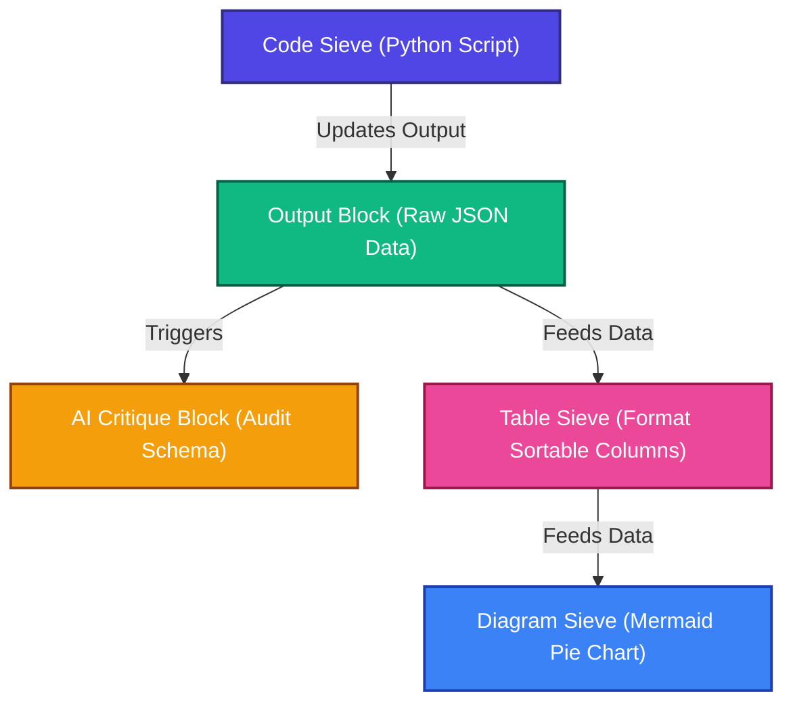
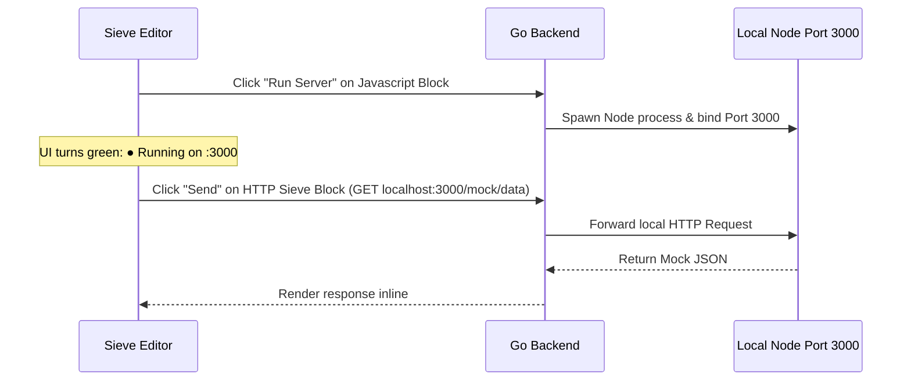

# Brainstorming: Smart Code Blocks & Executable Document Pipelines

This document captures high-level, "blue sky" ideation around transforming Sieve code blocks from static text nodes into intelligent, reactive, and executable components.

---

## 1. Core Product Vision: The Document as a Living Environment

Currently, Sieve provides an elegant interface for mixing prose with isolated code blocks, diagrams, and AI prompts. However, the code blocks behave primarily as static text containers. 

By upgrading Sieve blocks to support native execution and state-sharing, Sieve can transition from a **note-taking tool about code** into a **reactive, local-first development breadboard**.

---

## 2. The Reactive DAG (Sieve Chaining)

Rather than executing blocks in isolation, Sieve blocks can form a Directed Acyclic Graph (DAG) based on data dependencies. When an upstream node updates, it triggers a cascading recalculation down the page.

### The Pipeline Cascade
A change in an upstream code block propagates through the document:



### Visual Experience of the Pipeline
* **Pending States:** When the top code block runs, all downstream dependent blocks instantly enter a loading or pulsing state (e.g. glowing border).
* **Narrative Lineage:** A user can follow the data transformation chronologically down the page, watching the document recalculate and redraw its diagrams automatically.


## AI Chain re-evaluation
Even without this pipoeline idea - there may be something about re-evaluating AI Blocks - when other sieve nodes change.  So right now each AI Block contains its own chain.  But maybe they should be effecitvely a linked list.  And each link is like a listener in the backend.  If one changes - then it triggers the next to do a "Replay" - therefore always up to date.  SO those kind of "Review" this document use cases - could be self fullfilling.

Now anything automatic like this - could have issues - what is a singificant enough change to warrant the expense of re-evaluating an entiore block?
---

## 3. The HTTP/API Sieve (Inline API Client)

Instead of using external tools like Postman, Insomnia, or a terminal, developers can document and execute API requests natively within the prose of the document.

### Interactive HTTP Blocks
Sieve can parse standard HTTP or `curl` code blocks and overlay interactive client UI controls.

````markdown
### Get User Profile
```http
GET https://api.github.com/users/octocat
Accept: application/vnd.github.v3+json
Authorization: Bearer {{GITHUB_TOKEN}}
```
````

* **Wails Execution:** The Go backend (via native HTTP clients) executes the request, manages headers/cookies, and streams the response back.
* **Interactive JSON Tree:** The output is rendered inline directly below the request as a collapsible, searchable interactive JSON block.
* **Global Environments:** A special `env` block at the top of the document can hold variables (like token secrets or base URLs) that dynamically interpolate across all HTTP blocks.

---

## 4. The AI API Critic & Swagger Integration

By coupling HTTP blocks with AI Sieve blocks, we create an automated, real-time testing feedback loop.

```
+--------------------------------------------------------+
|  HTTP Sieve (GET /api/v1/users)                       |
|  [200 OK]                                              |
+--------------------------------------------------------+
                           |
                           v (JSON Output Payload)
+--------------------------------------------------------+
|  AI Critic Sieve                                       |
|  "Analyze this schema and design practices"            |
|                                                        |
|  Critique:                                             |
|  - Inconsistent naming: 'userId' vs 'created_at'.      |
|  - Security Alert: Password hash exposed in body.       |
+--------------------------------------------------------+
```

* **Automated Audits:** The AI Critic Sieve evaluates HTTP request/response payloads to catch REST API design smell, security flaws (like leaking PII), or malformed payloads.
* **OpenAPI/Swagger Importers:** Dragging a `swagger.yaml` into Sieve could automatically unpack it into a structured playbook of interactive HTTP Sieve blocks, serving as a dynamic dashboard for testing a service.

---

## 5. The Server Sieve (Microservice Breadboard)

Taking the pipeline concept to its ultimate conclusion: Sieve could act not just as an HTTP *client*, but as an HTTP *server* hosting local mocks or microservices.

### Running Local Servers in Code Blocks
A developer could define an API controller inside a standard Go, Node, or Python block, and spin it up instantly:

````markdown
```javascript
const express = require('express');
const app = express();

app.get('/mock/data', (req, res) => {
  res.json({ status: "success", items: [1, 2, 3] });
});

app.listen(3000);
```
````



### Sandbox Orchestration
* **Go Port Management:** The Go backend manages child processes, monitors stdout logs, and exposes a UI to stop the server (killing the process and releasing the port).
* **Self-Contained Mocking:** This enables testing complex client-server interactions, webhooks, or API behaviors locally, entirely within a single document, without committing code to repository branches or configuring external containers.

---

## 6. Implementation Reference Points

When prototyping these concepts, the existing Sieve architecture provides a robust base:
* **Node Attributes & Views:** [sieve-block-extension.js](file:///home/stephen/Development/projects/sieve/frontend/src/static/sieve-block-extension.js) handles HTML data attribute compilation and handles the lifecycle of custom block UI nodes.
* **Editing & Input Handling:** [code-renderer.js](file:///home/stephen/Development/projects/sieve/frontend/src/static/code-renderer.js) demonstrates how Sieve isolates editor focus, highlighting, and debounced synchronization between the frontend DOM and Go.
* **Go Ast/Parsing Lifecycles:** [code_processor.go](file:///home/stephen/Development/projects/sieve/sieve/code_processor.go) defines how the Go backend detects block types, manages compilation jobs, and serializes nodes back into Markdown.
