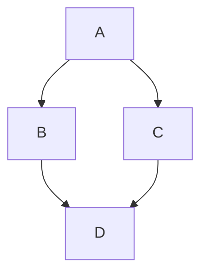

# Specification: Diagram Blocks (Mermaid)

## 1. Overview
The "Diagram Blocks" feature enables users to create and preview architectural diagrams, flowcharts, and sequences directly within the Stash editor using **Mermaid.js**. These blocks function as "smart" code blocks that can toggle between a textual definition and a rendered visual representation.

## 2. User Experience

### 2.1 Creation & Syntax
Users define a diagram using standard Markdown fenced code blocks with the `mermaid` language identifier:



### 2.2 Mode-Driven Interaction
Diagram blocks support two stable states: **View Mode** (rendered SVG) and **Edit Mode** (raw Markdown text). The transition between these states is **explicit**, driven by the `mode` attribute.

- **View Mode (Default)**: The diagram is rendered as an SVG. In this mode, the diagram can be interacted with (e.g., right-click to copy image, zoom, or select text within the SVG) without accidentally triggering the text editor.
- **Edit Mode**: The block displays the raw Mermaid markup with line numbers for editing.

### 2.3 Explicit Switching & Sizing
To prevent "flickering" between views during normal navigation, switching modes requires an explicit gesture:
- **`Ctrl + D`**: Toggles the active block between View and Edit modes.
- **Edit Overlay**: Hovering over a rendered diagram reveals an "Edit" button (pencil icon) in the corner to switch to Edit Mode.
- **Draggable Sizing**: In **View Mode**, the diagram container features a resize handle (bottom-right). Users can drag to resize the diagram, matching the behavior of Stash's image management.
- **Done/Preview Button**: In Edit Mode, a "View" or "Done" button (check icon) appears to commit changes and render the diagram.
- **Note on Focus**: Simply clicking or focusing the block does **not** switch it to Edit Mode if it is currently in View Mode.

## 3. State Persistence (Mode & Size Awareness)

To respect user intent, the block remembers its display mode and dimensions if explicitly changed.

- **Storage Format**: display mode and dimensions are stored as attributes in the fenced code block's info string, following the pattern established by `CodeBlockWithAttrs`.
    - ` ```mermaid mode="view" width="600" height="400" `
- **Serialization Logic**:
    - When the user toggles the mode or resizes the diagram, the `mode`, `width`, and `height` attributes are updated on the ProseMirror node.
    - Upon saving, the Markdown serializer writes these attributes into the "fence" info line.
    - Omitted attributes default to "auto" or "view" on next load.

## 4. Technical Architecture

### 4.1 Frontend (React / Tiptap)
- **Extension**: `DiagramBlock` (extending `CodeBlockLowlight`).
- **Parsing**: The `markdown-it` parser must be configured to recognize the `mode` attribute in the info string and map it to a node attribute.
- **NodeView**: A custom React NodeView (`DiagramNodeView.tsx`):
    - **Interpreter**: Reads the `mode`, `width`, and `height` attributes from the node.
    - **Conditional Render**:
        - If `mode === 'edit'`, it renders a `<NodeViewContent as="code" />` for standard text editing.
        - If `mode === 'view'` (or missing), it renders a stylized container with the Mermaid SVG output.
    - **Sizing**: The container is constrained by the `width` and `height` attributes. If they are provided, the container uses those fixed dimensions; otherwise, it defaults to responsive width.
    - **Interactive Resize**: Adds a drag-to-resize listener that updates the node attributes in real-time.
    - Loads the `mermaid` library dynamically (to keep the initial bundle small).
    - Uses `mermaid.render()` to generate SVGs from the Markdown content.
    - Wraps the raw text in a `<NodeViewContent />` for Editing and a stylized `div` for View mode.

### 4.2 Themes & Aesthetics
- **Theme Variables**: The Mermaid renderer will be initialized with theme variables derived from Stash's current CSS theme (e.g., Mariana, Dark, Light).
- **Styling**: Diagrams will be center-aligned and limited to the editor's width, with a subtle border/background in View mode to distinguish them from standard text.

## 5. Implementation Roadmap
1.  **Phase 1**: Implement the `DiagramBlock` extension and basic NodeView toggle logic.
2.  **Phase 2**: Integrate `mermaid-js` and implement the SVG rendering pipeline.
3.  **Phase 3**: Add `Ctrl + D` shortcut and state persistence (attribute round-tripping).
4.  **Phase 4**: Polish theme integration and CSS variables mapping.

## 6. Edge Cases
- **Invalid Syntax**: If Mermaid fails to parse the text, the block should display a helpful error message and automatically switch back to (or stay in) Edit Mode.
- **Large Diagrams**: Implement a "scrollable" container or a "zoom-on-click" for extremely large diagrams to prevent layout breakage.
- **Static Export**: Ensure that if the Markdown is exported or viewed in a non-Stash tool, it remains a standard, readable fenced code block.
