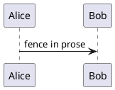
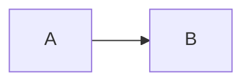
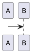

# Confluence export UAT

Each section names what it tests. Export this document as Confluence storage, paste it into a new empty page's `</>` source view, save, and check each section against its expectation.

## 1. Headings and inline formatting

### Third-level heading

Plain text, **bold**, *italic*, ~~struck~~, and `inline {code}` with braces.
A [web link](https://example.com), a [sieve link](sieve://00000000-0000-7000-8000-000000000000) that should show as text only, and an autolink https://example.org.
This line ends with a hard break\
and this line follows it.

Expect: a real h3; bold/italic/strike rendered; monospace shows `{code}` literally; the web link and autolink are clickable; the sieve link is plain text; the two lines break where the backslash is.

## 2. Escaping (each paragraph should read exactly as Sieve displays it)

Mid-word stays put: a-b-c, snake_case_name, x^2, well-known.

Word-edge characters: -not struck-, \_not italic\_, +not underlined+, ^not super^, \~not sub\~, ??not a citation??

Always-special: {not a macro}, [not a link], a | b, !not an image!

h1. this paragraph is not a heading

bq. this paragraph is not a quote

\* this paragraph is not a bullet

\# this paragraph is not a numbered item

Expect: no formatting, no stray markup, no broken links, and no visible backslashes. Storage format has no character these need escaping from, so each paragraph reads as typed.

## 3. Lists

- bullet one
  - nested bullet
    - third level
- bullet two

1. first
2. second
   - mixed bullet under a number
3. third

- item with a second paragraph

  second paragraph of the same item
- item with a fence under it

  ```go
  fmt.Println("in a list")
  ```

- item after the fence

Expect: correct nesting, and a bullet list nested under the numbered item. The fence under the item is a Go code macro inside that item, and the list continues after it.

## 4. Task list

- [ ] open task
- [x] done task

Expect: bullets starting with ☐ and ☑.

## 5. Quote

> A quoted paragraph.
>
> A second quoted paragraph, with **bold**.

Expect: one indented quotation holding both paragraphs.

## 6. Fences inside prose

```go
package main

func main() {}
```

```python
def f(x):
    return {"a": x}
```

```golang
// 'golang' should map to Confluence's 'go'
```

```sh
echo "sh should map to shell"
```

```
no language at all
```

```cobolish
unknown language: expect a plain code macro, no language
```





Expect, in order: Go, Python, Go, Shell and plain code macros; a plain code macro for the unknown language; a RENDERED PlantUML diagram; the mermaid source as a plain code macro.

## 7. Pipe table

| Name | Value | Note |
| --- | --- | --- |
| **bold** | `a \| b` | [link](https://example.com) |
| plain | 42 | ~~old~~ |

Expect: a header row, two body rows, formatting inside cells, and the pipe shown literally inside the monospace.

## 8. Complex table (HTML form: fences and lists in cells)

<table>
<tr><th>

Case

</th><th>

Content

</th></tr>
<tr><td>

Fence in a cell

</td><td>

```json
{"id": 1, "ok": true}
```

</td></tr>
<tr><td>

List and fence in one cell

</td><td>

- first point
- second point

```go
x := 1
```

</td></tr>
<tr><td>

PlantUML in a cell

</td><td>



</td></tr>
</table>

Expect: a 2-column table with a header row. The cells hold a JSON code macro, then a bullet list followed by a Go code macro, then a rendered PlantUML diagram.

## 9. Sieve blocks

```code
language: go
source: |
  func Add(a, b int) int {
      return a + b
  }
```

```log
source: |
  2026-09-27T10:00:00Z INFO  server started port=8080
  2026-09-27T10:00:01Z ERROR connection refused host=db
```

```diagram
diagramType: plantuml
source: |
  @startuml
  actor User
  User -> Sieve: export
  Sieve -> Confluence: paste
  @enduml
```

```diagram
diagramType: mermaid
source: |
  graph TD; Export-->Paste
```

Expect: a Go code macro; a plain code macro for the log; a RENDERED PlantUML sequence diagram; the mermaid source as a plain code macro. These are real Sieve blocks, not prose fences, and must look the same as section 6.

## 10. Rule and images

---


Expect: a horizontal rule, then an image loaded from the remote URL — example.com serves no logo, so a broken-image placeholder is the pass. A local `assets/…` image would be its alt text instead: Sieve's assets do not resolve outside Sieve.
